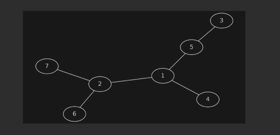

# [Chopping Wood](https://liu.kattis.com/courses/AAPS/AAPS25/assignments/kvhyuh/problems/chopwood)

## Problem

Given an unrooted tree structure as in the picture below, we chop it into pieces in the following way: pick the smallest numbered leaf, and remove the edge connecting that leaf to the tree. Then repeat this process until nothing is left of the tree.




To record this process, we write list the edges of the tree in the order they were chopped off, and write each edge as “u v” where u is the leaf and v is its connecting vertex. So for the figure above we get:

```bash
u v 
3 5 
4 1
5 1 
1 2 
6 2 
2 7
```

Unfortunately, we lost the first column of data of this extremely important list so we only have the “v” column. Can you help us reconstruct the “u” column? The vertices of the tree are always numbered from 1 up to the number of vertices.
### Input

The first line of input contains an integer $n$ ($1 \le n \le 200\, 000$) giving the length of the list. The next $n$ lines each contain an integer between 1 and $n+1$ (inclusive), describing the v column of the list.

### Output

If the u column can be uniquely determined, write $n$ lines of integers giving the u column of the list. If the u column can not be uniquely determined (either because no tree exists which results in the given v column, or because many different such trees exist), write a single line containing the word “Error”.

**Warning**
This problem has somewhat large amounts of input and output. We recommend you to make sure that your output is properly buffered, otherwise your solution may be too slow.


### Sample Input 1 

```bash
6
5
1
1
2
2
7

```

### Sample Output 1

```bash
3
4
5
1
6
2

```